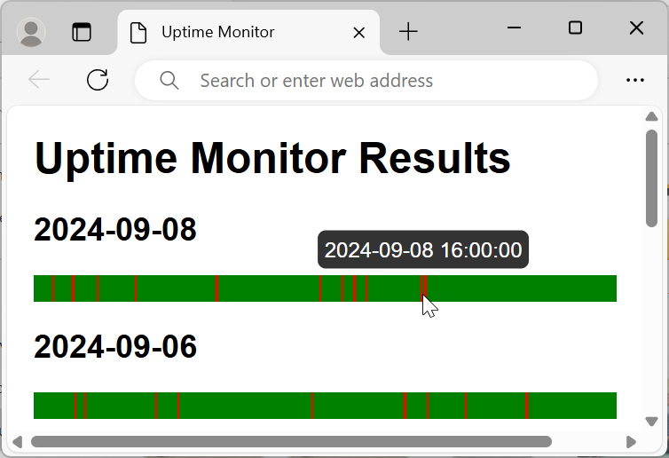

# Camera Uptime Monitor

A mini PowerShell utility designed to monitor the uptime of a network device (in this case an IP camera) and generate an HTML report visualizing its availability over time.

## Features

- A single mini `PowerShell ps1` script that can be run on a Windows machine
- Checks device availability using TCP connection attempts every 5 minutes
- Generates a HTML report with a color-coded timeline 

## Screenshot


## Usage

 - Modify the script to include your device's IP address and desired output file path.
 - Right click and `Run with PowerShell` or:
   ```powershell
   .\uptime-monitor.ps1
